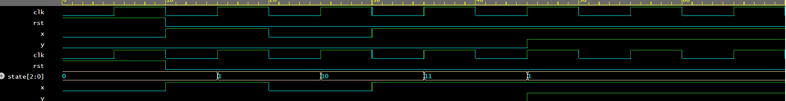

# Sequence-decoder
verilog implementation of a sequence decoder
Sequence Detector (1011) using Verilog HDL
## Discription

This project implements a Sequence Detector using a Finite State Machine (FSM). The detector monitors a serial input stream and generates a high output whenever the sequence 1011 is detected. The design demonstrates FSM state transitions, sequential logic, and waveform verification through simulation.

## Tools Used

. Verilog HDL
. EDA Playground
. GTKWave

## Features

. Detects sequence 1011
. FSM-based design
. Simulation and waveform analysis
. Suitable for digital design and VLSI learning

## Author
Manasa mytri

## Simulation Result

